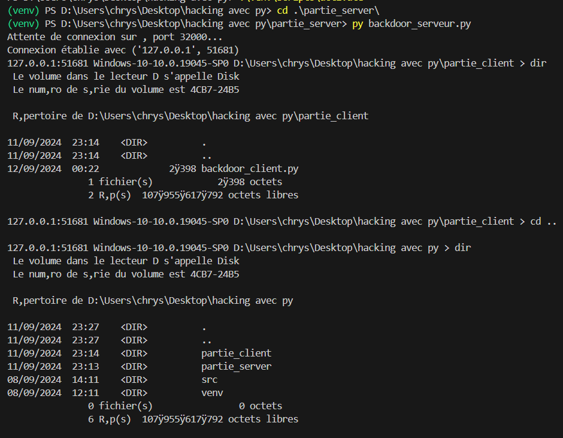
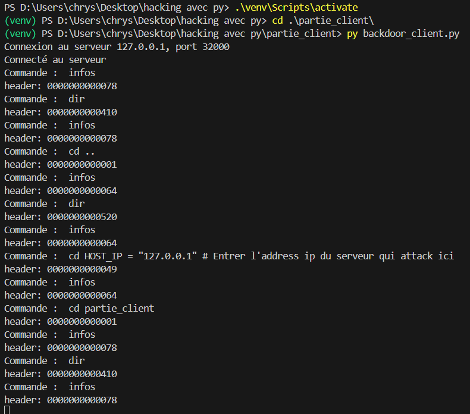

# Projet de Communication Client-Serveur avec Sockets Réseau

Ce projet met en place une communication entre un serveur et un client via des sockets réseau. Il permet d'exécuter des commandes à distance, de récupérer des informations système, de télécharger des fichiers ou des captures d'écran, et de naviguer dans le système de fichiers de la machine cliente.

### Fonctionnalités principales
1. **Exécution de commandes à distance** : Le serveur envoie des commandes au client, qui les exécute localement et renvoie le résultat.
2. **Téléchargement de fichiers** : Le serveur peut demander au client de lui envoyer un fichier spécifique, que le client lit et envoie.
3. **Capture d'écran** : Le serveur peut demander au client une capture d'écran, qui est sauvegardée et envoyée au serveur.
4. **Navigation dans le système de fichiers** : Le serveur peut changer de répertoire sur la machine cliente.
5. **Gestion des erreurs** : Le code gère les erreurs comme l'absence de fichiers ou de répertoires.

## Prérequis

- [Python 3.11](https://www.python.org/downloads/)
- Bibliothèque [Pillow](https://pillow.readthedocs.io/en/stable/) pour la capture d'écran (utilisée côté client)

## Installation

1. Clonez ce dépôt sur votre machine locale :
   ```bash
   git clone https://github.com/ChrysDavid/Control-d-une-machine-a-distance
   cd Control-d-une-machine-a-distance
   ```

2. Installation et activation de l'environnement virtuel :
    - *Créer un environnement virtuel :*
        ```bash
        python -m venv venv
        ```
    - *Activer l'environnement virtuel sous Windows :*
        ```bash
        venv\Scripts\activate
        ```
    -  *Activer l'environnement virtuel sous Linux/Mac :*
        ```bash
        source venv/bin/activate
        ```


2. Installez les bibliothèques nécessaires (Pillow pour la capture d'écran) :
    ```bash
    pip install Pillow
    ```

3. Modifiez les adresses IP dans les fichiers serveur et client pour qu'elles correspondent à l'environnement dans lequel vous travaillez. Le serveur écoute sur l'adresse `127.0.0.1` (localhost), mais vous pouvez la changer si nécessaire.

## Fonctionnalités

- Le serveur attend une connexion d'un client.
- Une fois connecté, le client peut envoyer des commandes pour :
  - Obtenir des informations système (commande `infos`).
  - Changer de répertoire (`cd <path>`).
  - Télécharger un fichier (`dl <filename>`).
  - Capturer une capture d'écran et la télécharger (`capture <filename>`).
  - Exécuter des commandes shell (`commande shell`).

## Utilisation

### 1. Lancer le serveur

Dans une console, exécutez le script du serveur sur la machine serveur :
```bash
python backdoor_serveur.py
```
Cela lancera le serveur en attente de connexions sur l'IP spécifiée (par défaut `127.0.0.1`) et le port `32000`. 

### 2. Lancer le client

Dans une autre console, exécutez le script du client sur une machine client :
```bash
python backdoor_client.py
```

Le client tentera de se connecter au serveur. En cas d'échec, il réessayera jusqu'à ce qu'une connexion soit établie.

### 3. Envoi de commandes

Une fois connecté, le client peut envoyer des commandes au serveur :

- **Obtenir des informations système :**
  ```bash
  infos
  ```

- **Changer de répertoire :**
  ```bash
  cd <path>
  ```

- **Télécharger un fichier :**
  ```bash
  dl <filename>
  ```

- **Capturer une capture d'écran et la télécharger :**
  ```bash
  capture <filename>
  ```

- **Exécuter des commandes shell :**
  Toute commande non reconnue sera traitée comme une commande shell et exécutée sur la machine serveur.

### Exemple d'Exécution

1. Sur le serveur :
   

2. Sur le client :
   


## Structure du Code

### Serveur

- **socket_receive_all_data(socket_p, data_len)** : Fonction pour recevoir des données sur le socket jusqu'à ce que la longueur spécifiée soit atteinte.
- **socket_send_command_and_receive_all_data(socket_p, command)** : Fonction pour envoyer une commande et recevoir la réponse complète.
- **Serveur principal** : Le serveur écoute les connexions entrantes, traite les commandes, et envoie les réponses au client. Il peut gérer les téléchargements de fichiers et les captures d'écran.

### Client

- **Connexion au serveur** : Le client tente de se connecter au serveur et de lui envoyer des commandes.
- **Gestion des commandes** : Le client peut envoyer plusieurs types de commandes, notamment des commandes shell, des requêtes pour des informations système, des téléchargements de fichiers, et des captures d'écran.

## Limitations et Améliorations

- **Connexion réseau** : Le client réessaie de se connecter en boucle si la connexion échoue.
- **Téléchargements** : Les fichiers peuvent être téléchargés, mais il n'y a pas encore de gestion des fichiers volumineux ou de transfert par fragments.

## Licence
```
Ce projet est sous licence MIT.
```
